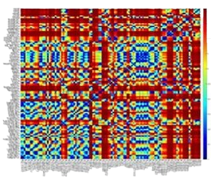

<h1 align='center'><b>nanoTorch</b></h1>

    A PyTorch like AI Engine from scratch in C programming language

  

NanoTorch is a lightweight, minimalistic deep learning library written in pure       C, designed to bring essential neural network functionalities to low-resource environments. Inspired by projects like tinygrad, NanoTorch aims to provide a foundational toolkit for machine learning enthusiasts, embedded developers, and researchers who want to experiment with deep learning concepts in an efficient, resource-conscious manner.

#### Key Features

-	Lightweight Design: Focused on simplicity, NanoTorch provides core deep learning operations without heavy dependencies.
-	Pure C Implementation: Built entirely in C, NanoTorch is designed to be portable and optimized for low-level manipulation.
-	 Gradient Calculation: Includes basic automatic differentiation to support backpropagation for training models.
-	 Flexible Tensor Operations: Supports fundamental tensor operations required for deep learning.
-	 Modular Architecture: Easy to extend or modify, allowing you to explore and experiment with new layers, optimizers, and more.

#### Who is This For?

NanoTorch is perfect for those looking to:
-	 Understand the inner workings of a deep learning library from the ground up.
-	 Run simple neural networks in resource-limited environments.
-	 Prototype and test custom ML operations in C.

#### Getting Started

This repository includes setup instructions, usage examples, and documentation to help you dive into developing with NanoTorch. Explore the source code to understand how core deep learning concepts like tensor operations and automatic differentiation are implemented.

#### Contributing

NanoTorch is open for contributions! Whether you’re fixing bugs, adding new features, or experimenting with optimizations, we welcome your input.

# Progress and Roadmap

NanoTorch is designed to provide an accessible, low-level deep learning framework with a focus on simplicity and modularity. Here’s a roadmap showcasing its primary components and future progress milestones:

## Core Components

❌: Not implemented  
✅: Done

1.	Tensor Operations

-    Tensor Creation and Manipulation: Support for tensor creation with various data types (float, double, int) and shapes.

| Task       | Status |
|------------|--------|
| Tensor     |   ✅   |

-    Basic Tensor Math:

| Task       | Status |
|------------|--------|
| ADD        |   ✅   |
| SUB        |   ✅   |
| MUL        |   ✅   |
| DIV        |   ✅   |
| MATMUL     |   ✅   |
| EXP        |   ✅   |
| LOG        |   ❌   |
| POW        |   ✅   |
| SUM        |   ✅   |
| TRANSPOSE  |   ❌   |
| FLATTEN    |   ❌   |
| RESHAPE    |   ❌   |
| CONV2D     |   ❌   |
| CONV3D     |   ❌   |
| MAXPOOL2D  |   ❌   |
| MAXPOOL3D  |   ❌   |

-	Operation Derivative

| Task           | Status |
|----------------|--------|
| add_backward   |   ✅   |
| sub_backward   |   ✅   |
| mul_backward   |   ✅   |
| div_backward   |   ✅   |
| matmul_backward|   ✅   |
| exp_backward   |   ✅   |
| log_backward   |   ❌   |
| pow_backward   |   ✅   |
| sum_backward   |   ✅   |

-    Memory Management: Efficient use of malloc, calloc, memcpy, and memset for optimized memory handling.

| Task       | Status |
|------------|--------|
| Free Tensor|   ✅   |

2.	Automatic Differentiation

-	Gradient Storage: Each tensor can store its gradient, initialized with calloc for zeroing the memory.

| Task          | Status |
|---------------|--------|
| grad	        |   ✅   |
| requires_grad |   ✅   |

-	Backward Propagation: Simple backpropagation framework to calculate gradients for model parameters.

| Task       | Status |
|------------|--------|
| Backward   |   ✅   |

-	Operators for Gradient Tracking: Support for chaining operations to compute gradients through layers of the network.

| Task       | Status |
|------------|--------|
| prev       |   ✅   |
| op	     |	 ✅   |
| num_prev   |	 ✅   |

3.	Basic Neural Network Layers
   
-	Linear (Dense) Layer: Implement a fully connected layer, allowing the network to learn transformations.

| Task       | Status |
|------------|--------|
| Linear     |   ❌   |

-	Activation Functions: Include foundational activation functions (e.g., ReLU, Sigmoid, Tanh) with support for gradient calculations.

i.	Activations

| Task      | Status |
|-----------|--------|
| relu      |   ✅   |
| sigmoid   |   ✅   |
| tanh      |   ✅   |
| softmax   |   ✅   |
| leaky_relu|   ✅   |
| mean      |   ✅   |

ii.	Activations Derivative

| Task                | Status |
|---------------------|--------|
| relu_backward       |   ✅   |
| sigmoid_backward    |   ✅   |
| tanh_backward       |   ✅   |
| softmax_backward    |   ✅   |
| leaky_relu_backward |   ✅   |
| mean_backward       |   ✅   |

-	Loss Functions: Basic loss functions like Mean Squared Error and Cross-Entropy to train simple models.
### Loss Functions

| Task      | Status |
|-----------|--------|
| MSE       |   ❌   |
| CE        |   ❌   |
| BCE       |   ❌   |
| SoftmaxCE |   ❌   |

4.	Optimization Algorithms
   
-	Gradient Descent: Implement vanilla gradient descent for updating weights.

| Task            | Status |
|-----------------|--------|
| step optimizer  |   ❌   |

 
-	Extensions: Planned support for optimizations like Stochastic Gradient Descent (SGD) and other optimizers (e.g., Adam) as the library progresses.
### Optimizers

| Task  | Status |
|-------|--------|
| ADAM  |   ❌   |
| SGD   |   ❌   |

5.	Training and Evaluation Loop
   
-	Forward and Backward Passes: Execution of forward pass and automatic differentiation for backpropagation.
  
-	Metrics Tracking: Calculate and log accuracy or loss during training.
  
-	Progress Display: Basic progress bar for training epochs and mini-batches.
### Layers

| Task       | Status |
|------------|--------|
| SEQUENTIAL |   ❌   |
| LINEAR     |   ❌   |
| DROPOUT    |   ❌   |
| CONV2D     |   ❌   |
| CONV3D     |   ❌   |
| MAXPOOL2D  |   ❌   |
| MAXPOOL3D  |   ❌   |

# Future Milestones

1.	Additional Neural Network Layers
   
-	Convolutional Layers: Add convolution layers for basic image-processing tasks.
  
-	Pooling Layers: Max and average pooling layers for reducing spatial dimensions.

  
2.	Expanded Tensor Operations
   
-	Broadcasting: Support for basic broadcasting to handle mismatched tensor shapes.
  
-	Advanced Math Operations: Include more operations (e.g., exponentiation, logarithms) for increased model complexity.

  
3.	GPU/Hardware Support
   
-	OpenCL/CUDA Integration: Explore integration with OpenCL or CUDA to leverage GPUs for faster computation.
  
-	SIMD Optimizations: Use SIMD instructions for faster CPU-based tensor operations.

  
4.	Serialization and Model Exporting
   
-	Model Saving and Loading: Save model weights and parameters for reproducibility and deployment.
  
-	ONNX Export: Basic support for ONNX format export, allowing compatibility with other deep learning frameworks.

  
5.	Python Bindings
   
-	Python API: Create a minimal Python API for easy usage and debugging, making it accessible for Python-based experimentation.
